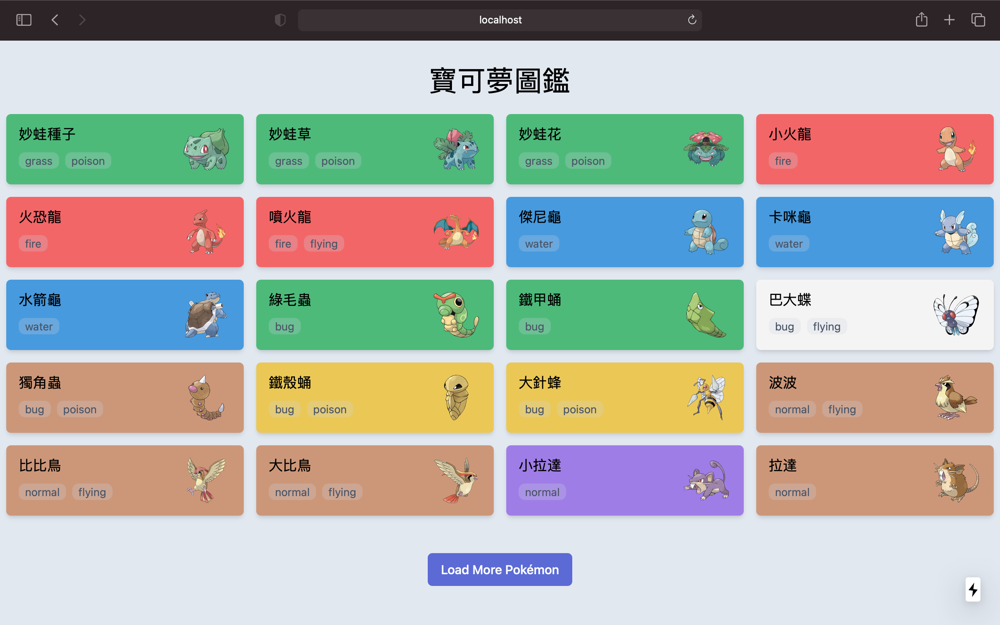

( [Demo](https://pokedex.ajiang.co/) || [Code](https://github.com/teaware/pokedex) )

[Next.js](https://nextjs.org/) 当前最火最热的 React 框架！

[SWR](https://swr.vercel.app/) 时下最强最有潜力的 React Hooks 库！

我们结合使用 Next.js 和 SWR 动手开发 `宝可梦图鉴` 这个小项目来学习它是如何运作的

### 🔧 创建项目

首先用命令行工具新建一个项目，很简单，只需要一行代码

```bash
npx create-next-app
# or
yarn create next-app
```

### 🔌 PokeAPI

[PokeAPI](https://pokeapi.co/) 是一个免费提供宝可梦数据的 API 对于我们的 `宝可梦图鉴` 项目是必不可少的，阅读官方文档大致了解如何使用这个接口

### 👉🏻 初始页面

在刚刚创建完成的项目目录中，我们找到 `pages/index.js` 然后编辑它

```jsx{14-16}
import Head from "next/head"
import useSWR from "swr"

const fetcher = url => fetch(url).then(res => res.json())

function HomePage() {
  const { data } = useSWR(`https://pokeapi.co/api/v2/pokemon/`, fetcher)

  if (!data) return <h1>Loading...</h1>
  const { results } = data

  return (
    <>
      <Head>
        <link href="https://unpkg.com/tailwindcss@^1.0/dist/tailwind.min.css" rel="stylesheet" />
      </Head>
      <section className="container py-6 mx-auto">
        <h1 className="text-4xl text-center mb-2">寶可夢圖鑑</h1>
        <div>
          {results.map(pokemon => {
            return <div key={pokemon.name}>{pokemon.name}</div>
          })}
        </div>
      </section>
    </>
  )
}

export default HomePage
```

> 注意：这里直接通过 CDN 使用 [Tailwind](https://tailwindcss.com/) 只是为了便捷，在实际项目中，这种方法并非使用 Tailwind 的最佳方式！

### ➕ 加载更多

参考 [SWR 文档](https://swr.vercel.app/docs/pagination)以及[示例](https://swr.vercel.app/examples/infinite-loading)，我们对 `pages/index.js` 做如下修改

```jsx{8}
import Head from "next/head";
import { useSWRInfinite, SWRConfig } from "swr";

const fetcher = (url) => fetch(url).then((res) => res.json());
const PAGE_SIZE = 20;

function CatchEmAll() {
  const { data, error, size, setSize } = useSWRInfinite(
    (index) =>
      `https://pokeapi.co/api/v2/pokemon/?offset=${
        PAGE_SIZE * index
      }&limit=${PAGE_SIZE}`,
    fetcher
  );

  const pokemonList = data ? [].concat(...data) : [];
  const isLoadingInitialData = !data && !error;
  const isLoadingMore =
    isLoadingInitialData ||
    (size > 0 && data && typeof data[size - 1] === "undefined");
  const isEmpty = data?.[0]?.length === 0;
  const isReachingEnd =
    isEmpty || (data && data[data.length - 1]?.length < PAGE_SIZE);

  return (
    <>
      <Head>
        <link
          href="https://unpkg.com/tailwindcss@^1.0/dist/tailwind.min.css"
          rel="stylesheet"
        />
        <title>寶可夢圖鑑</title>
      </Head>
      <section className="container py-6 mx-auto">
        <h1 className="text-4xl text-center mb-2">寶可夢圖鑑</h1>
        <div className="flex flex-wrap">
          {pokemonList.map((pokemon) => {
            return pokemon.results.map((result) => (
              <div
                className="p-2 w-full sm:w-1/2 md:w-1/2 lg:w-1/3 xl:w-1/4"
                key={result.name}
              >
                <div className="rounded-md shadow-md w-full p-2 bg-gray-500">
                  <div className="poke-name flex justify-between items-center px-1">
                    {result.name}
                  </div>
                </div>
              </div>
            ));
          })}
        </div>
        <div className="mx-auto py-10 w-1/2 text-center">
          <button
            className="inline-flex items-center px-4 py-2 border border-transparent text-base leading-6 font-medium rounded-md text-white bg-indigo-600 hover:bg-indigo-500 focus:outline-none"
            disabled={isLoadingMore || isReachingEnd}
            onClick={() => setSize(size + 1)}
          >
            {isLoadingMore
              ? Loading
              : isReachingEnd
              ? "No More Pokémon"
              : "Load More Pokémon"}
          </button>
        </div>
      </section>
    </>
  );
}

function HomePage() {
  return (
    <SWRConfig value={{ fetcher }}>
      <CatchEmAll />
    </SWRConfig>
  );
}

export default HomePage;
```

这里通过 `useSWRInfinite` 中的 `setSize` 函数向 PokeAPI 请求新的数据，实现加载更多这个功能

### 📇 宝可梦卡片

上一步我们实现了加载更多，但是仅仅获取了宝可梦的英文名。现在我们希望展示宝可梦的图片和中文名，要怎么做呢？

新建 components 文件夹并创建 `pokemon.js`

```jsx{4-5, 8-12}
import useSWR from "swr";

function Pokemon({ name }) {
  const { data: pokemon } = useSWR(`https://pokeapi.co/api/v2/pokemon/${name}`);
  const { data: pokemonSpecies } = useSWR(() => pokemon.species.url);

  const bgc = pokemonSpecies ? pokemonSpecies.color.name : "gray"; // background-color
  const names = pokemonSpecies ? [].concat(...pokemonSpecies.names) : [];
  const lan = names.filter((obj) => {
    return obj.language.name === "zh-Hant"; // 宝可梦的繁体中文名
  });
  const theName = pokemonSpecies ? lan[0].name : name;

  return (
    <div className="p-2 w-full sm:w-1/2 md:w-1/2 lg:w-1/3 xl:w-1/4">
      <article className={`rounded-md shadow-md w-full p-3 bg-${bgc}-500`}>
        {pokemon ? (
          <div className={`poke-name id-${pokemon.id} flex justify-between items-center px-1`}>
            <div>
              <h2 className="text-lg capitalize mb-2">{theName}</h2>
              <div>
                {pokemon.types.map((type) => (
                  <span
                    key={type.type.name}
                    className="inline-block bg-gray-400 bg-opacity-25 rounded-lg px-2 text-sm text-gray-700 mr-2 mb-2"
                  >
                    {type.type.name}
                  </span>
                ))}
              </div>
            </div>
            <div className="w-16 h-16 ml-1">
              
            </div>
          </div>
        ) : (
          <p className="font-bold text-l capitalize">Loading {name}...</p>
        )}
      </article>
    </div>
  );
}

export default Pokemon;
```

这里首先获取 `pokemon` 的数据，然后通过已获取数据 `pokemon.species.url` 使用 `useSWR()` 获取 `pokemonSpecies`

`pokemonSpecies.names` 是一个包含宝可梦多国语言名称的数组，我们用 `filter` 函数筛选出我们需要的语言。

接下来我们回到 `pages/index.js` 引入 `Pokemon` 部件，代码调整如下

```jsx{3, 17}
import Head from "next/head";
import { useSWRInfinite, SWRConfig } from "swr";
import Pokemon from "../components/pokemon";

...

return (
    <>
      <Head>
        <title>寶可夢圖鑑</title>
      </Head>
      <section className="container py-6 mx-auto">
        <h1 className="text-4xl text-center mb-2">寶可夢圖鑑</h1>
        <div className="flex flex-wrap">
          {pokemonList.map((pokemon) => {
            return pokemon.results.map((result) => (
              <Pokemon key={result.name} name={result.name} />
            ));
          })}
        </div>
        <div className="mx-auto py-10 w-1/2 text-center">
          <button
            className="inline-flex items-center px-4 py-2 border border-transparent text-base leading-6 font-medium rounded-md text-white bg-indigo-600 hover:bg-indigo-500 focus:outline-none"
            disabled={isLoadingMore || isReachingEnd}
            onClick={() => setSize(size + 1)}
          >
            {isLoadingMore
              ? Loading
              : isReachingEnd
              ? "No More Pokémon"
              : "Load More Pokémon"}
          </button>
        </div>
      </section>
    </>
  );
}
```

( [Demo](https://pokedex.ajiang.co/) || [Code](https://github.com/teaware/pokedex) )