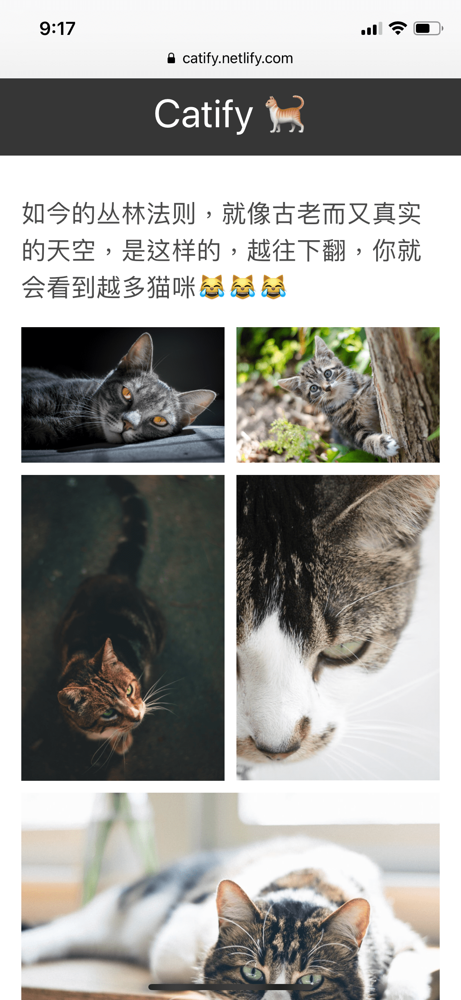

如今静态页面或者 [JAMStack](https://jamstack.org/) 这样的解耦开发架构的趋势如何？为什么许多顶尖的页面和应用程序开始转向使用“静态页面生成器”构建？因为它快速、安全、低成本、开发体验好...

### TL;DR

在这篇文章中，我们将

- 在本地安装并运行 Gatsby
- 在 Gatsby 中创建页面
- 在页面之间使用统一的 layout
- 创建无限滚动图片墙
- 创建一个 Netlify 函数来获取图片
- 在本地部署并使用 Netlify 函数
- 将获取的图片渲染到网格布局中
- 配置 netlify.toml
- 部署到 Netlify

### 为什么使用 Gatsby

[Gatsby](https://www.gatsbyjs.org/) 是一个当下时髦的开源静态页面生成器。它具备构建高性能、安全、低成本、可部署的页面的能力。后面的不翻译了，总之就是很好 😂

### 为什么使用 Netlify

[Netlify](https://www.netlify.com/) 为现代应用程序提供了很好的部署体验，直观、便捷。

### 安装

本教程需要您具备一定的知识，包括 HTML, CSS, JavaScript, 还有 React

Node.js 以及它的包管理工具 NPM 是必需的， 请确认你的机器上是否已经安装

```bash
node -v && npm -v
```

此命令会输出 node 和 npm 的版本号。如果没有妥善安装，请前往[Node.js](https://nodejs.org/)下载安装。

安装 Gatsby CLI

```bash
npm i -g gatsby-cli
```

一旦 CLI 工具安装完成，我们就可以在工作路径下创建新的 Gatsby 项目，在命令行工具中输入以下命令

```bash
gatsby new catify
```

该命令会克隆 Gatsby 默认起始页到你的指定文件夹，同时安装该项目的所有依赖包。
接下来我们进入项目文件夹并安装几个新的依赖

```bash
cd catify && npm i --save axios bulma react-infinite-scroll-component
```

如此 我们安装了

- [Axios](https://github.com/axios/axios): 把 HTTP 请求转化成 API 的工具
- [Bulma](https://bulma.io/): 轻量的 CSS 框架
- [React-inifinite-scroll-component](https://www.npmjs.com/package/react-infinite-scroll-component): 一个简单可定制的无限滚动 React 部件

接下来我们运行开发环境服务器：

```bash
gatsby develop
```

### 配置页面布局

页面布局会被视作一个可复用部件来开发。 `components/layout.js` 文件目前输出的是 Gatsby 默认起始页的布局。我们删除它原来的所有内容，引入我们需要的东西

```jsx
import React from "react"
import PropTypes from "prop-types"
import { useStaticQuery, graphql } from "gatsby"

import Header from "./header"
```

这里我们引入了 React, prop-types, useStaticQuery 和 GraphQL 其中 useStaticQuery 是在 Gatsby v2 版本才引进的，正因如此使得我们可以在非页面部件之间使用 GraphQL 数据请求。这些数据获取是静态的且发生在构建过程中，所以使用静态查询（Static Query）这个术语。

包含导航栏的`Header` 部件（我们稍后创建）也被引入，这里我们先补全 `Layout` 部件的剩余代码

```jsx
const Layout = ({ children }) => {
  const data = useStaticQuery(graphql`
    query SiteTitleQuery {
      site {
        siteMetadata {
          title
        }
      }
    }
  `)

  return (
    <>
      <Header siteTitle={data.site.siteMetadata.title} />
      <div
        style={{
          margin: `0 auto`,
          maxWidth: 900,
          padding: `0px 1.0875rem 1.45rem`,
          paddingTop: 0,
        }}
      >
        <main>{children}</main>
      </div>
    </>
  )
}

Layout.propTypes = {
  children: PropTypes.node.isRequired,
}

export default Layout
```

这里 `useStaticQuery` 用于从 siteMetadata 获取页面标题，`siteTitle` 随即作为参数从 header 部件传递过来。
下一步我们打开位于根目录的 `gatsby-config.js` 文件修改页面标题和描述

```js
siteMetadata: {
  title: `Catify`,
  description: `A cat infinite scroll image gallery built with Gatsby, Netify & Unsplash.`,
  author: `@author`
},
```

现在编辑 `components/header.js` 文件

```jsx
import { Link } from "gatsby"
import React from "react"

const Header = ({ siteTitle }) => (
  <header>
    <nav className="navbar is-dark" style={{ marginBottom: "2em" }}>
      <div className="navbar-brand">
        <Link
          to="/"
          style={{
            margin: "0 auto",
            padding: "10px",
          }}
          className="has-text-white is-size-3"
        >
          {siteTitle} 🐈
        </Link>
      </div>
    </nav>
  </header>
)

export default Header
```

### 创建新页面

#### 首页

在 `src/pages/index.js` 文件中删除原有的代码引入依赖项

```jsx
import React from "react"
import { Link } from "gatsby"
import Layout from "../components/layout"
import SEO from "../components/seo"
import "bulma/css/bulma.min.css"
```

注意 Bulma 样式文件的引入方式，接下来定义此部件的导出部分

```jsx
const IndexPage = () => (
  <Layout>
    <SEO title="Home" />
    <div className="has-text-centered" style={{ marginTop: "20%" }}>
      <h1 className="is-size-2">欢迎光临！...喵的世界😹</h1>
      <button className="button is-dark is-large" style={{ marginTop: "10%" }}>
        <Link to="/gallery" className="has-text-white">
          OK 👌
        </Link>
      </button>
    </div>
  </Layout>
)

export default IndexPage
```

我们使用了 Bulma 内建的 class 名称来定义我们的页面样式

#### 图册页面

在同一路径 `src/pages` 下，新建一个 `gallery.js` 文件。与首页类似，我们引入然后导出...

```jsx
import React from "react"
import Layout from "../components/layout"
import SEO from "../components/seo"
import InfiniteImages from "../components/InfiniteImages"

const Gallery = () => {
  return (
    <Layout>
      <SEO title="Gallery" />
      <h1 className="is-size-5" style={{ marginBottom: "1.0875rem" }}>
        如今的丛林法则，就像古老而又真实的天空，是这样的，越往下翻，你就会看到越多猫咪😹😹😹
      </h1>
      <InfiniteImages />
    </Layout>
  )
}

export default Gallery
```

### 创建图片集

使用 Gatsby 这样的工具好处在于我们可以在部件之间发起 API 请求，并在运行过程中把数据传递到 DOM 让你在静态工作环境中有种异步开发的爽快感。我们将从 [Unsplash](https://unsplash.com/)获取图片，用 `react-infinite-scroll-component` 实现无限滚动。

在 `src/components` 路径下新建文件 `InfiniteImages.js`

```jsx
import React from "react"
import PropTypes from "prop-types"
import InfiniteScroll from "react-infinite-scroll-component"
```
